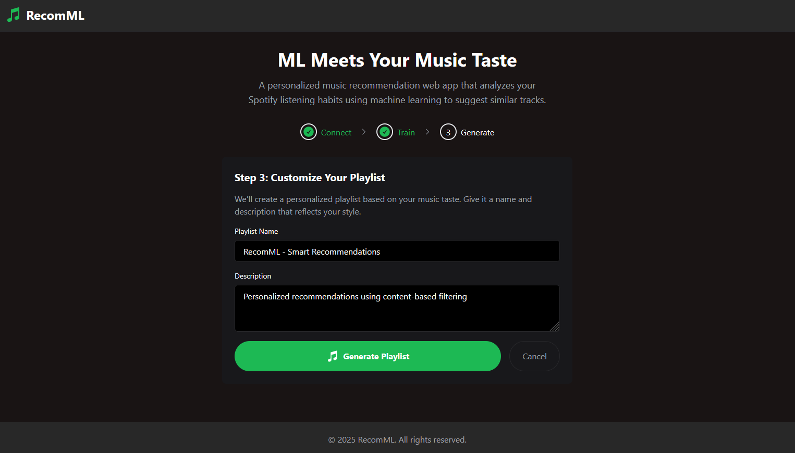

# RecomML 🎵

RecomML is a personalized music recommendation web app that analyzes your Spotify listening habits using machine learning to suggest similar tracks and automatically creates a custom playlist saved to your Spotify account.

## Screenshots 📸


_Step 1: Connect your Spotify account to grant RecomML access to your listening history_


_Step 2: The machine learning model analyzes your music preferences. Click "Start Analysis" to begin processing your listening history_


_Step 3: After successful model training, you can proceed to create a playlist based on your musical taste_


_Step 4: Personalize your playlist by setting a custom name and description. These details will appear in your Spotify account._


_Step 5: Final results shows your generated playlist with similarity scores for each recommended track_

## Features ✨

- **Spotify Integration**: Seamlessly connects with your Spotify account
- **Machine Learning Analysis**: Analyzes your music preferences using content-based filtering
- **Personalized Recommendations**: Generates a playlist based on the similarity of the songs you are listening to
- **Automatic Playlist Creation**: Creates and saves custom playlists directly to your Spotify account
- **Modern UI/UX**: Clean, very minimalistic, responsive interface with Spotify-like design
- **Progress Tracking**: Clear 3-step process with visual feedback

## How It Works 🔍

1. **Connect**: Link your Spotify account to grant RecomML access to your listening history
2. **Train**: Our machine learning model analyzes your music preferences from your spotify account
3. **Generate**: Get personalized track recommendations and a custom playlist

## Tech Stack 🛠️

- **Frontend**: React
- **Styling**: Tailwind CSS
- **Authentication**: Spotify OAuth
- **Database**: MongoDB
- **Machine Learning**: Content-based filtering algorithm
- **API**: Node.js/Express backend

## Machine Learning Algorithm 🧠

The recommendation system uses a sophisticated content-based filtering approach that combines multiple techniques:

1. **TF-IDF (Term Frequency-Inverse Document Frequency)**

   - Used for analyzing track names and artist names
   - Helps identify important terms that characterize each song

2. **String Similarity Analysis**

   - Compares track names and artist names using string similarity metrics
   - Helps find songs with similar titles or by similar artists

3. **Feature-based Similarity**

   - Track name similarity (30% weight)
   - Artist name similarity (30% weight)
   - Token-based similarity (20% weight)
   - Popularity score similarity (20% weight)

4. **Natural Language Processing**
   - Tokenization of track and artist names
   - Case normalization
   - Genre analysis

The algorithm processes your listening history to create a unique musical profile and finds songs that match this profile based on the weighted combination of these features.

## Getting Started - Installation Process 🚀

### Prerequisites

- Node.js (v14 or higher)
- MongoDB
- Spotify Developer Account

### Installation

1. Clone the repository:

```bash
git clone https://github.com/yourusername/RecomML.git
cd RecomML
```

2. Install dependencies:

```bash
npm install
```

3. Create a `.env` file in the root directory:

```env
VITE_SPOTIFY_CLIENT_ID=your_spotify_client_id
VITE_SPOTIFY_REDIRECT_URI=http://localhost:5173
MONGODB_URI=your_mongodb_uri
```

4. Start the development server:

```bash
npm run dev
```

## Acknowledgments 🙏

- Spotify Web API
- React Community
- TailwindCSS Team

## Future Scope & Improvements 🚀

### Machine Learning Enhancements

- Implement collaborative filtering alongside content-based filtering
- Add support for audio feature analysis (tempo, key, danceability, etc.)
- Incorporate user feedback and ratings to improve recommendations
- Implement deep learning models for better music understanding

### Feature Additions

- Add support for creating multiple playlists with different moods
- Add music preview functionality
- Include detailed track analytics and insights
- Add support for other music streaming platforms

### Technical Improvements

- Add unit tests and integration tests
- Implement caching for faster recommendations
- Improve error handling and user feedback
- Optimize performance for large music libraries

### UI/UX Enhancements

- Add dark/light theme toggle
- Implement drag-and-drop playlist organization
- Add visualization for recommendation reasoning
- Improve mobile responsiveness
- Add accessibility features

## Contributing 🤝

Contributions are always welcome! Please feel free to submit a Pull Request.

1. Fork the project
2. Create your feature branch (`git checkout -b feature/AmazingFeature`)
3. Commit your changes (`git commit -m 'Add some AmazingFeature'`)
4. Push to the branch (`git push origin feature/AmazingFeature`)
5. Open a Pull Request

## Contact 📧

Your Name - [@sakt2011](https://twitter.com/sakt2011)

Project Link: [https://github.com/hardy07/RecomML](https://github.com/hardy07/RecomML)
